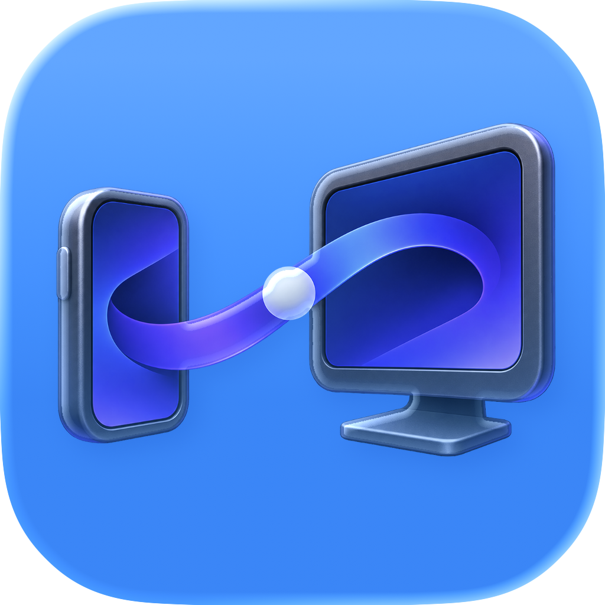
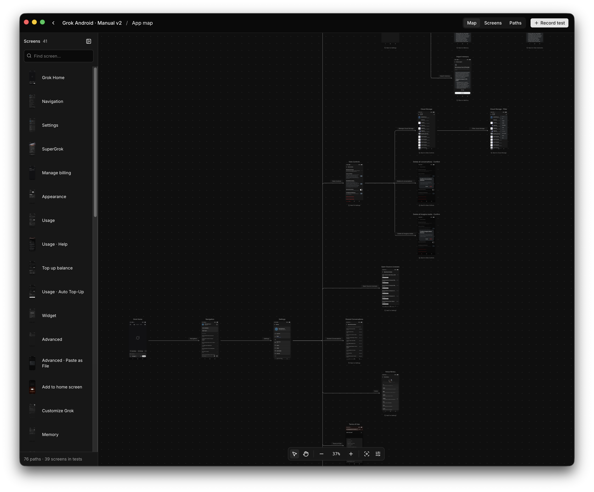

<div align="center">



# Relay

**Record tests. Replay them. See what happened.**

</div>

Relay is a desktop app for testing websites, Android apps, and iOS apps. You use your app while Relay records your actions, then save those steps as a test you can run again. It keeps screenshots and results together so you can understand what happened without repeating the whole test yourself.



A test can be as simple as opening a menu or as involved as going through checkout. Along the way, you can check that something appears, wait for a response, or capture a screenshot. When you run the test again, Relay shows the result of each step. You can compare screenshots with earlier versions and decide whether a change looks right.

The App Map brings the screens you’ve visited into one view, connected by the actions that lead between them. It helps you understand how a flow fits into the rest of your app. As your tests grow, you can organize them into plans and repeat them with different languages, data, or devices.

Relay includes a [plugin with an agent skill](./plugins/relay-proof/README.md), an [MCP server](./packages/mcp/README.md), and a CLI for coding agents and scripts. Agents can interact with your app, run saved tests, and inspect the same screenshots and results you see in the desktop app. Optional AI exploration lets you describe something to investigate, review the findings, and save a useful path as a test.

Your tests and results are stored locally in your project. Recording, replay, and screenshot review work without a model key; AI exploration uses a configured model provider. Relay is still in active development, and browser and device support varies by platform.

## Getting started

To run Relay from source, install **Node.js 24+**, **pnpm**, and the **Vite+ CLI** (`vp`), then:

```bash
git clone https://github.com/bernaferrari/relay.git
cd relay
vp install
pnpm dev:desktop
```

In the app, choose **New Test** and enter a website or select a connected device. Record a short flow, review the steps, and save it. You can then run it again and open the result to see the captured screens.

Run `pnpm doctor` if you have trouble with setup. Android requires `adb`, and physical iOS devices require Apple developer tooling. To use Relay in a browser, run `pnpm dev:web` instead.

## Agents and development

The plugin bundles MCP configuration and a skill for verifying code changes. Setup instructions cover Codex, Claude Code, and compatible MCP hosts. You can also use the CLI to run a saved test:

```bash
pnpm relay connect
pnpm relay run settings-localization
pnpm relay export-evidence <run-id>
```

Replace `settings-localization` with the name of your test. `pnpm relay --help` lists the available commands. Optional AI exploration requires `OPENROUTER_API_KEY`.

### Keeping screen identity consistent

Keyboard and input focus states belong to the same logical screen. Capture automatically reuses a screen when current semantic evidence matches one saved app structure uniquely; it retains the new identity alias and capture. A shared title or sparse tree is insufficient to merge screens.

For existing duplicates, compare their captures in the App Map and use **Merge with another screen**. Agents can use `relay screen consolidate <appMapId> <targetScreenId>` with `mode:"same-screen"`, `sourceScreenIds`, the current `expectedRevision`, and `dryRun:true` in `--input`. Inspect the preview before applying without dry run. The merge retains evidence and executable actions, rewires saved Tests, and keeps input states selectable as captures. Replay an affected Test after merging.

The map places saved Test origins first and groups parallel paths into one wire. Click a grouped wire and use **Choose path** to inspect its individual actions. Return paths stay beside their screen until inspected so they do not obscure forward navigation.

If you’re making changes to Relay, use `vp check` for formatting and lint, `pnpm typecheck` for type checks, and `pnpm test` to run the tests.
`pnpm test:coverage` writes package LCOV reports; CI requires at least 70% line coverage across changed source in packages with a coverage script. The `ui-react` package contains shared UI components without a separate unit suite; product visual and accessibility checks cover its rendered use in the app.
The [product contract](./PRODUCT_CONTRACT.md) defines the public routes, vocabulary, and interaction rules checked in CI.
